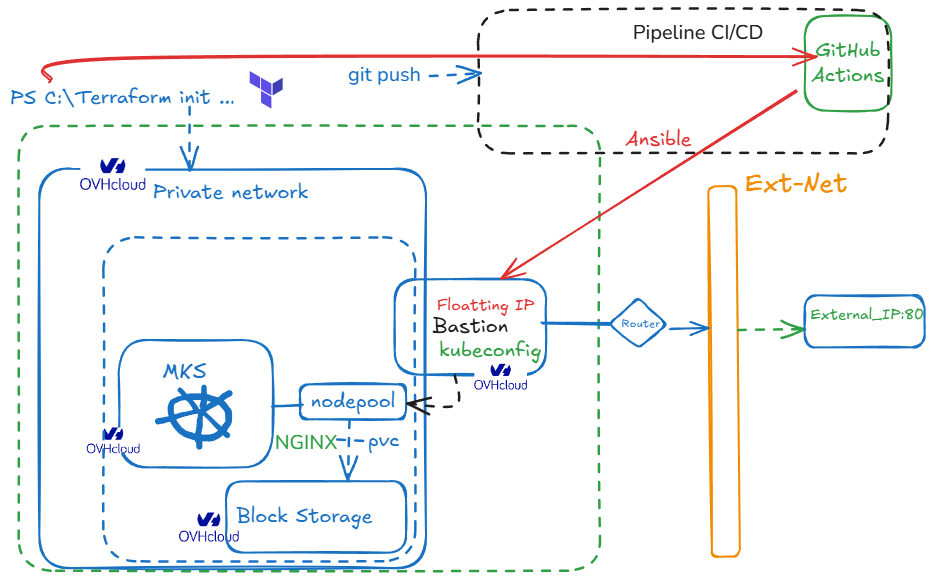

# OVHCloud Infrastructure Project

This repository contains Terraform code to deploy and manage infrastructure on OVHCloud. The infrastructure includes networking components, compute instances, and a Kubernetes cluster.

## Architecture

The infrastructure is organized into three main modules:

1. **Network Module**: Creates a private network with subnets and routing
2. **Instances Module**: Provisions compute instances including a bastion host
3. **Kubernetes Module**: Deploys a managed Kubernetes cluster



## Prerequisites

- Terraform v1.0.0+
- OVHCloud account with API credentials
- OpenStack credentials for your OVHCloud project

## Configuration

Create a `terraform.tfvars` file with the following variables:

```hcl
service_id                 = "your-ovh-service-id"
network_name               = "project-network"
os_private_network_vlan_id = 0
os_region                  = "GRA7"
image_name                 = "Ubuntu 20.04"
flavor_name                = "s1-2"
ssh_public_key             = "ssh-rsa AAAA..."

# OVH API credentials
ovh_application_key        = "your-app-key"
ovh_application_secret     = "your-app-secret"
ovh_consumer_key           = "your-consumer-key"

# OpenStack credentials
openstack_user_name        = "user-xxxx"
openstack_password         = "your-password"
openstack_tenant_name      = "your-tenant-name"
```

## Module Structure

### Network Module

Creates a private network, subnet, router, and configures connectivity.

**Key Resources:**
- Private network with VLAN
- Private subnet with DHCP
- Router with external gateway
- Router interface connecting to private subnet

### Instances Module

Provisions compute instances including a bastion host with public IP.

**Key Resources:**
- SSH key pair
- Bastion host instance
- Floating IP for bastion access

### Kubernetes Module

Deploys a managed Kubernetes cluster on OVHCloud.

**Key Resources:**
- Kubernetes cluster connected to private network
- Node pool with autoscaling configuration

## Usage

1. Initialize Terraform:
   ```
   terraform init
   ```

2. Plan the deployment:
   ```
   terraform plan -out=tfplan
   ```

3. Apply the configuration:
   ```
   terraform apply tfplan
   ```

4. Access the bastion host:
   ```
   ssh ubuntu@$(terraform output bastion_public_ip)
   ```

5. Access the Kubernetes cluster:
   ```
   terraform output kubeconfig > ~/.kube/config
   kubectl get nodes
   ```

## Outputs

- `bastion_public_ip`: Public IP address of the bastion host
- `private_network_id`: ID of the created private network
- `kubernetes_cluster_id`: ID of the Kubernetes cluster
- `kubeconfig`: Kubernetes configuration for cluster access

## Cleanup

To destroy all resources:

```
terraform destroy
```

## Notes

- The bastion host is the only instance with a public IP and serves as the entry point to the private network
- The Kubernetes cluster is deployed in the private network for enhanced security
- All resources are tagged with the project name for better organization